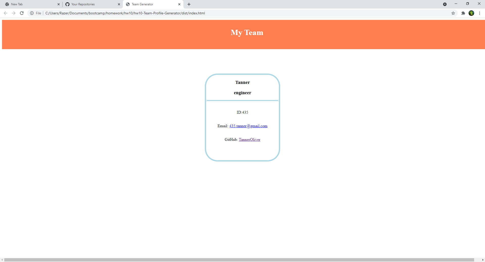

# hw10-Team-Profile-Generator

## Description
In this project we were to create a generator using inquirer prompts and classes to make them. We also ran tests with jest so we can test our main class and subclasses. When you type in the prompts you will dynamically create an html document that will have your team members.

## ScreenShot

## Table of Contents
- [Installation](#installation)
- [Usage](#usage)
- [Contribution](#contribution)
- [Test](#test)
- [Questions](#questions)

## Installation
we used jest and inquirer so you can run npm install inquirer and npm install jest

## Usage
You can use this to make a team of managers, interns and engineers.

## Contribution
Inquirer, and Jest

## Test
You could test it by building teams and seeing if it breaks
  
## Questions
My GitHub is: [TannerOliver](https://github.com/TannerOliver)
You can reach me at Email: 435.tanner@gmail.com